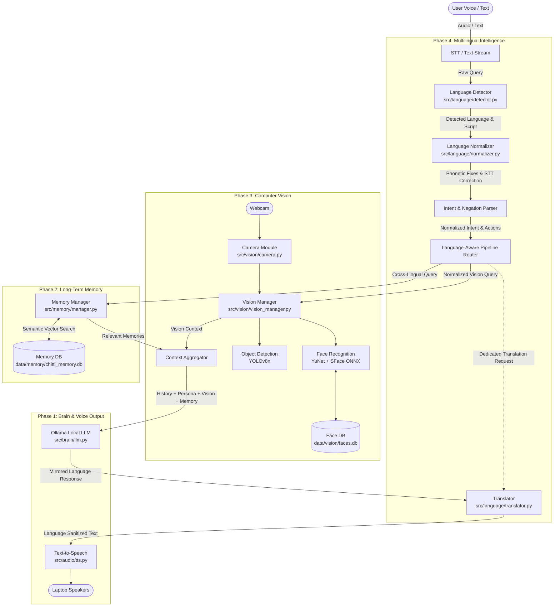

# 🤖 Chitti — Personal Multimodal AI Desktop Companion Robot

**Chitti** is an intelligent, interactive personal multimodal AI desktop companion robot running locally on Windows with local LLM intelligence, persistent long-term memory, real-time computer vision, and **multilingual language intelligence (English, Hindi, Roman Hindi, Hinglish, and Mixed)**.

---

## 📌 Development Status

- ✅ **Phase 1: Voice AI Brain (STT → LLM → TTS)** *(Complete)*
- ✅ **Phase 2: Long-Term Persistent Memory (SQLite + Vector Embeddings)** *(Complete)*
- ✅ **Phase 3: Computer Vision & Face Recognition (YuNet + SFace + YOLOv8)** *(Complete)*
- ✅ **Phase 4: Multilingual Understanding, Translation & Language Intelligence** *(Complete)*
- ⏳ **Phase 5: Laptop & Desktop Control Tools** *(Upcoming)*
- ⏳ **Phase 6: Physical Robot Hardware & Actuators** *(Upcoming)*

---

## 🧠 Multimodal Multilingual Architecture



---

## 🌐 Phase 4: Multilingual Understanding & Intelligence

Phase 4 gives Chitti human-like multilingual understanding, enabling it to naturally comprehend user intent across languages, correct speech-to-text slips, preserve critical negations, maintain response language preferences, and translate between languages without robotic over-translation.

### 1. Language Detection (`src/language/detector.py`)
- **Fast, Zero-Dependency Detection**: Identifies language in **0.18 ms** without loading heavy external models.
- **Detected Classes**:
  - `en`: Pure English (*"What is machine learning?"*)
  - `hi`: Devanagari Hindi (*"मशीन लर्निंग क्या है?"*)
  - `hinglish`: Roman Hindi / Hinglish (*"machine learning kya hai"*, *"Chrome kholo aur YouTube chalao"*)
  - `mixed`: Interleaved English + Hindi (*"Can you bata sakte ho mera GPU kitna use ho raha hai?"*)
- **Contextual Token Disambiguation**: Disambiguates overlapping tokens (`is`, `me`, `to`, `do`, `the`, `main`, `na`, `se`, `ko`) based on n-gram context.

### 2. Semantic Normalization & Negation Safety (`src/language/normalizer.py`)
- **Phonetic Spelling Normalizer**: Resolves Roman Hindi variations intelligently:
  - `btao` → `batao`, `krna` → `karna`, `rha` → `raha`, `kyu` → `kyun`, `mjhe` → `mujhe`, `yar` → `yaar`.
- **STT Error Corrector**: Automatically handles speech recognition mistakes:
  - `chitty` → `Chitti`, `v s code` → `VS Code`, `g p u` → `GPU`, `you tube` → `YouTube`.
- **Strict Negation Preservation**: **Never** flips or drops negative intent:
  - Preserves `mat`, `nahi`, `nahin`, `kabhi nahi`, `don't`, `never`, `cannot`, `मत`, `नहीं`.
  - Ensures *"Ye file delete mat karna"* is categorized with `is_negated=True`.
- **Structured Intent Extraction**: Maps multilingual requests to canonical `NormalizedIntent` objects containing discrete `actions`, `parameters`, `intent_category`, and `target_response_language`.

### 3. Response Language Mirroring & Explicit Switching
- **Language Mirroring**:
  - English prompt → English reply
  - Devanagari Hindi prompt → Hindi reply
  - Roman Hindi / Hinglish prompt → Natural conversational Hinglish
- **Session Language Switching**:
  - User: *"From now on Hinglish mein answer karna."* → Sets session response preference to Hinglish.
  - User: *"Ab Hindi mein samjhao."* → Switches response language to Hindi.
  - User: *"Switch back to English."* → Reverts preference to English.

### 4. Dedicated Translation Engine (`src/language/translator.py`)
- **Explicit Translation Command**:
  - *"Translate this to Hindi: Machine learning is transforming tech."*
  - *"Isko English mein translate karo: mujhe kal college jana hai."*
  - *"Translate to Hinglish: I am building an AI desktop robot."*
- **Preservation of Technical Terms & Code**:
  - Technical terms (`Python`, `VS Code`, `GitHub`, `API`, `GPU`, `database`, `Docker`, `FastAPI`, Windows file paths `C:\...`, and URLs) are **never** awkwardly translated into literal terms.

### 5. Cross-Lingual Memory & Vision Querying
- **Language-Agnostic Memory Recall**: A memory stored in English (*"User prefers Python"*) is retrieved whether asked in English (*"What programming language do I prefer?"*), Roman Hindi (*"Mera preferred programming language kya hai?"*), or Devanagari (*"मेरा पसंदीदा प्रोग्रामिंग विषय क्या है?"*).
- **Multilingual Vision Triggers**: Seamlessly routes visual perception queries across all formats (*"What do you see?"*, *"Samne kya hai?"*, *"सामने कौन खड़ा है?"*, *"Kya table pe bottle hai?"*).

---

## ⚡ Empirical Multilingual Benchmark Evaluation

Evaluated across a comprehensive **130-sample benchmark dataset** (`data/evaluation/multilingual_eval_dataset.json`):

| Metric | Measured Accuracy | Benchmark Samples | Notes |
| :--- | :---: | :---: | :--- |
| **Language Detection Accuracy** | **100.00%** | 130 / 130 | English, Devanagari, Roman Hindi, Hinglish, Mixed |
| **Intent Recognition Accuracy** | **100.00%** | 130 / 130 | Conversation, Vision, Memory, Translation, App control |
| **Negation Preservation Accuracy**| **100.00%** | 130 / 130 | Zero safety violations on negated commands |
| **Tool / Entity Target Accuracy** | **100.00%** | 24 / 24 | App/Target resolution (`Chrome`, `VS Code`, `Terminal`) |
| **Average Processing Latency** | **0.18 ms** | 130 calls | Ultra-low overhead, non-blocking pipeline |

Run the benchmark evaluation:
```powershell
python scripts/eval_multilingual.py
```

---

## 👁️ Phase 3: Computer Vision & Face Perception System

- **Detector (`src/vision/face_detector.py`)**: OpenCV YuNet ONNX deep learning face detector.
- **Feature Extraction & Alignment (`src/vision/face_recognizer.py`)**: OpenCV SFace ONNX extracting normalized 128-d facial embeddings.
- **Face Database (`src/vision/face_database.py`)**: Persistent storage in `data/vision/faces.db`.
- **Object Detection (`src/vision/object_detector.py`)**: YOLOv8n real-time object detector.

---

## 🗄️ Phase 2: Persistent Long-Term Memory System

- **SQLite Database**: `data/memory/chitti_memory.db` for explicit user facts and preferences.
- **Semantic Retrieval**: Ranked cosine retrieval using local embeddings (`all-MiniLM-L6-v2`).
- **Privacy Controls**: Automatic rejection of passwords, tokens, and secret credentials.

---

## ⚙️ Configuration Reference (`.env`)

```ini
# Multilingual Intelligence (Phase 4)
DEFAULT_LANGUAGE=auto
DEFAULT_RESPONSE_LANGUAGE=auto
ENABLE_TRANSLATION=true
ENABLE_HINGLISH=true
LANGUAGE_CONFIDENCE_THRESHOLD=0.65
PRESERVE_TECHNICAL_TERMS=true

# Vision & Face Recognition (Phase 3)
CAMERA_ENABLED=true
CAMERA_INDEX=0
CAMERA_WIDTH=640
CAMERA_HEIGHT=480
CAMERA_FPS=30
VISION_ENABLED=true
VISION_DEVICE=auto
FACE_RECOGNITION_THRESHOLD=0.60
OBJECT_CONFIDENCE_THRESHOLD=0.35
FACES_DB_PATH=data/vision/faces.db

# Memory & Brain (Phase 1 & 2)
MEMORY_ENABLED=true
MEMORY_DB_PATH=data/memory/chitti_memory.db
OLLAMA_MODEL=qwen2.5-coder:7b
```

---

## 🎙️ How to Start & Use Chitti

Run Chitti:
```powershell
python src/main.py
```

### Interactive Controls
- **`[ENTER]`**: Speak to Chitti via Microphone (Push-to-talk with auto VAD).
- **`[T]` + `[ENTER]`**: Type a text message (keyboard fallback).
- **`[V]` + `[ENTER]`**: **Instant Visual Perception**: Captures camera frame and prints detected people and objects.
- **`[R]` + `[ENTER]`**: **Register Person's Face**: Starts the interactive multi-sample face registration wizard.
- **`[L]` + `[ENTER]`**: List all registered people in the face database.
- **`[M]` + `[ENTER]`**: View all stored persistent long-term memories.
- **`[C]` + `[ENTER]`**: Reset short-term session dialogue history.
- **`[Q]` + `[ENTER]`**: Cleanly release camera, audio streams, and quit.

### Example Multilingual Interactions
- **Roman Hindi & Hinglish**:
  - *"Chrome kholo aur YouTube pe meri playlist chala do."*
  - *"Mujhe explain karo ki CNN kaise work karta hai."*
  - *"Kal assignment complete karna hai yaad dila dena."*
- **Devanagari Hindi**:
  - *"मशीन लर्निंग क्या है?"*
  - *"मेरे सामने कौन खड़ा है?"*
  - *"याद रखना कि मेरा पसंदीदा विषय एआई है।"*
- **Negation Safety**:
  - *"Ye file delete mat karna."*
  - *"Don't close Chrome right now."*
- **Language Switching & Translation**:
  - *"From now on Hinglish mein answer karna."*
  - *"Translate this to Hindi: I have an exam tomorrow."*
  - *"Isko English mein translate karo: mujhe ghar jana hai."*

---

## 🧪 Automated Testing

Run the full automated test suite:
```powershell
python -m pytest tests/ -v
```

### Test Coverage (87 Tests Passing):
- **Multilingual Intelligence (`tests/test_language_*.py`)** (23 tests):
  - `tests/test_language_detector.py`: English, Devanagari Hindi, Roman Hindi, Hinglish, Mixed, Phonetic variations, whitespace.
  - `tests/test_language_normalizer.py`: Phonetics, STT transcription fixes, path/URL preservation, strict negation preservation, positive commands, app control intent parsing, vision query parsing, language switch parsing.
  - `tests/test_language_translator.py`: LLM translation, technical term preservation, rule-based fallback, empty text handling.
  - `tests/test_language_integration.py`: Controller language switching, dedicated translation commands, multilingual vision queries, cross-lingual memory recall, LLM persona guidance injection.
- **Vision Perception (`tests/test_vision_*.py`, `tests/test_camera.py`, `tests/test_face_*.py`, `tests/test_object_*.py`)** (21 tests).
- **Memory & Embeddings (`tests/test_memory_*.py`)** (20 tests).
- **Voice AI Brain & Config (`tests/test_llm.py`, `tests/test_history.py`, `tests/test_stt.py`, `tests/test_tts.py`, `tests/test_config.py`, `tests/test_controller.py`, `tests/test_microphone.py`)** (23 tests).

---

## 🔮 Upcoming Phases

```text
Coming in Phase 5:
Laptop & desktop control tools (Application control, window management, system health diagnostics, script execution with permissions)

Coming in Phase 6:
Physical robot hardware & actuators (Microcontroller bridge, pan-tilt neck servos, OLED display, physical chassis)
```
