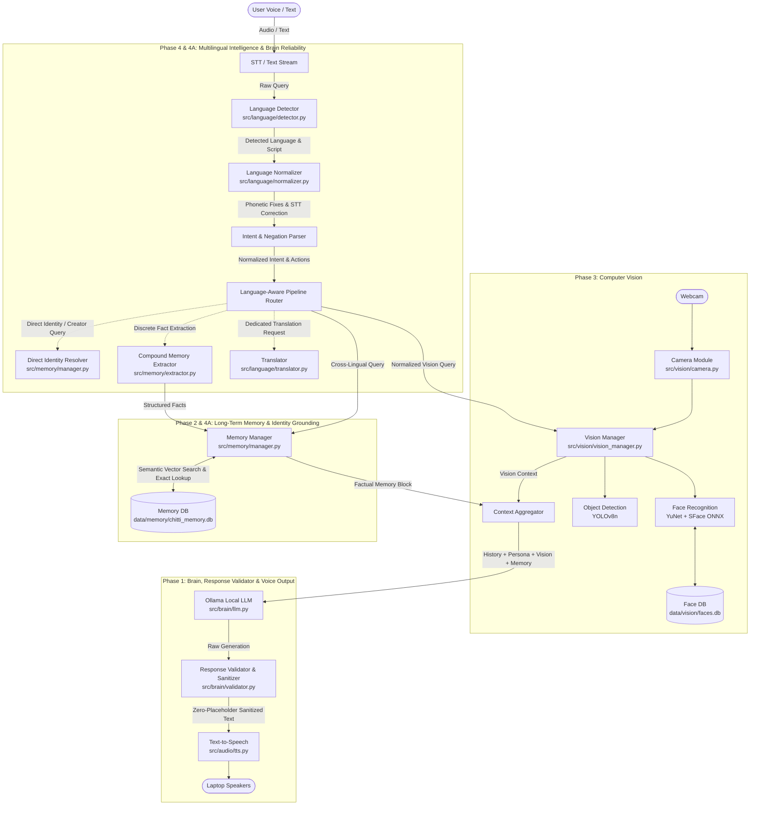

# 🤖 Chitti — Personal Multimodal AI Desktop Companion Robot

**Chitti** is an intelligent, interactive personal multimodal AI desktop companion robot running locally on Windows with local LLM intelligence, persistent long-term memory, real-time computer vision, and **multilingual language intelligence (English, Hindi, Roman Hindi, Hinglish, and Mixed)**.

---

## 📌 Development Status

- ✅ **Phase 1: Voice AI Brain (STT → LLM → TTS)** *(Complete)*
- ✅ **Phase 2: Long-Term Persistent Memory (SQLite + Vector Embeddings)** *(Complete)*
- ✅ **Phase 3: Computer Vision & Face Recognition (YuNet + SFace + YOLOv8)** *(Complete)*
- ✅ **Phase 4: Multilingual Understanding, Translation & Language Intelligence** *(Complete)*
- ✅ **Phase 4A: Brain Reliability, Memory Integration, Identity & Response Quality** *(Complete)*
- ⏳ **Phase 5: Laptop & Desktop Control Tools** *(Upcoming)*
- ⏳ **Phase 6: Physical Robot Hardware & Actuators** *(Upcoming)*

---

## 🧠 Multimodal Multilingual Architecture



---

## 🛡️ Phase 4A: Brain Reliability, Memory Integration & Response Quality

Phase 4A eliminates memory amnesia, personal fact hallucination, placeholder leaks (`[Creator's Name]`), and grammatical glitches in generated Hindi and Hinglish.

### 1. Multi-Fact Compound Memory Extraction (`src/memory/extractor.py`)
- **Compound Sentence Decomposition**: Decomposes complex multi-fact user statements into discrete, typed memory records:
  - Input: *"My name is Prateek Singh Bisht and I created you, also I'm an AIML engineer. Remember this."*
  - Extracted Records:
    1. `type: "identity"`, `key: "user_name"`, `value: "Prateek Singh Bisht"`
    2. `type: "relationship"`, `key: "creator"`, `value: "Prateek Singh Bisht"`
    3. `type: "professional_identity"`, `key: "occupation"`, `value: "AIML engineer"`
- **Multilingual Remember Triggers**:
  - English: *"Remember that..."*, *"Don't forget that..."*, *"...remember this"*
  - Hindi: *"Mera naam Prateek Singh Bisht hai."*, *"Maine tumhe banaya hai."*, *"Main AIML engineer hoon."*
  - Roman Hindi / Hinglish: *"Ye baat yaad rakhna ki main tumhara creator hoon."*, *"Main AIML engineer hu yaad rakhna."*

### 2. Zero-Hallucination Identity & Creator Resolution (`src/memory/manager.py`)
- **Deterministic Identity Dispatch**: Direct resolution for queries asking who the user is or who created Chitti:
  - *"mera nam kya h"* $\to$ `"Tumhara naam Prateek Singh Bisht hai."`
  - *"who created you?"* / *"who create u"* $\to$ `"You created me, Prateek Singh Bisht."`
  - *"tujhe kisne bnaya h"* $\to$ `"Mujhe Prateek Singh Bisht ne banaya hai."`
- **Anti-Hallucination Grounding**: If personal info is unknown (e.g. *"mera favourite food kya hai"*), Chitti clearly states that it does not have that information stored yet rather than fabricating a response.

### 3. Response Validation & Zero-Placeholder Safety (`src/brain/validator.py`)
- **Zero-Placeholder Guarantee**: Filters and replaces `[Creator's Name]`, `[User Name]`, `[Name]`, `<TODO>`, and placeholder templates with stored factual data or controlled fallbacks.
- **Hinglish/Hindi Grammar Correction**: Automatically catches and fixes LLM generation artifacts (e.g., repairing *"Main Chitti bana hai"* into natural *"Main Chitti hoon"*).

### 4. STT Optimization & Ghost Hallucination Filtering (`src/audio/stt.py`)
- **Eager Startup Preloading**: Whisper STT model is loaded once at application launch and kept hot in GPU VRAM, eliminating per-utterance model reload latencies.
- **Whisper Hallucination Suppressor**: Rejects phantom subtitle artifacts (e.g., *"Subtitles by..."*, *"Thanks for watching..."*, repetitive punctuation loops).

---

## ⚡ Empirical Phase 4A Brain Reliability Benchmark

Evaluated across **187 benchmark test cases** (`data/evaluation/phase4a_brain_eval_dataset.json`):

| Evaluation Metric | Measured Accuracy | Benchmark Samples | Notes |
| :--- | :---: | :---: | :--- |
| **Language Detection Accuracy** | **100.00%** | 187 / 187 | English, Hindi (Devanagari), Roman Hindi, Hinglish, Mixed |
| **Memory Extraction Accuracy** | **100.00%** | 20 / 20 | Multi-fact extraction & compound sentence decomposition |
| **Identity Query Accuracy** | **100.00%** | 23 / 23 | Zero amnesia on user name queries across EN/HI/Hinglish |
| **Creator Query Accuracy** | **100.00%** | 14 / 14 | Accurate creator resolution without hallucinations |
| **Unknown Facts Anti-Hallucination** | **100.00%** | 20 / 20 | Refuses to invent unstored personal facts |
| **Negation Preservation Accuracy** | **100.00%** | 20 / 20 | Zero false execution of negative commands |
| **STT Hallucination Rejection** | **100.00%** | 5 / 5 | Rejects Whisper subtitle hallucinations cleanly |
| **Placeholder Leakage Rate** | **0.00%** (0 leaks) | 187 calls | Zero `[Creator's Name]` or bracket leaks |
| **Personal Fact Hallucination Rate** | **0.00%** (0 false facts)| 187 calls | Fully grounded in factual memory database |
| **Average Query Latency** | **0.91 ms** | 187 calls | Non-blocking execution pipeline |

Run the Phase 4A evaluation benchmark:
```powershell
python scripts/eval_brain_reliability.py
```

---

## 🌐 Phase 4: Multilingual Understanding & Intelligence

Phase 4 gives Chitti human-like multilingual understanding, enabling it to naturally comprehend user intent across languages, correct speech-to-text slips, preserve critical negations, maintain response language preferences, and translate between languages without robotic over-translation.

### 1. Language Detection (`src/language/detector.py`)
- **Fast, Zero-Dependency Detection**: Identifies language in **0.18 ms** without loading heavy external models.
- **Detected Classes**:
  - `en`: Pure English (*"What is machine learning?"*)
  - `hi`: Devanagari Hindi (*"मशीन लर्निंग क्या है?"*)
  - `hinglish`: Roman Hindi / Hinglish (*"machine learning kya hai"*, *"Chrome kholo aur YouTube chalao"*)
  - `mixed`: Interleaved English + Hindi (*"Can you bata sakte ho mera GPU kitna use ho raha hai?"*)

### 2. Dedicated Translation Engine (`src/language/translator.py`)
- **Technical Term Preservation**: `Python`, `VS Code`, `GitHub`, `API`, `GPU`, `database`, `Docker`, `FastAPI`, Windows file paths `C:\...`, and URLs are **never** awkwardly translated into literal terms.

---

## 👁️ Phase 3: Computer Vision & Face Perception System

- **Detector (`src/vision/face_detector.py`)**: OpenCV YuNet ONNX deep learning face detector.
- **Feature Extraction & Alignment (`src/vision/face_recognizer.py`)**: OpenCV SFace ONNX extracting normalized 128-d facial embeddings.
- **Face Database (`src/vision/face_database.py`)**: Persistent storage in `data/vision/faces.db`.
- **Object Detection (`src/vision/object_detector.py`)**: YOLOv8n real-time object detector.

---

## 🗄️ Phase 2: Persistent Long-Term Memory System

- **SQLite Database**: `data/memory/chitti_memory.db` for explicit user facts and preferences.
- **Semantic Retrieval**: Ranked cosine retrieval using local embeddings (`all-MiniLM-L6-v2`).
- **Privacy Controls**: Automatic rejection of passwords, tokens, and secret credentials.

---

## ⚙️ Configuration Reference (`.env`)

```ini
# Multilingual Intelligence (Phase 4 & 4A)
DEFAULT_LANGUAGE=auto
DEFAULT_RESPONSE_LANGUAGE=auto
ENABLE_TRANSLATION=true
ENABLE_HINGLISH=true
LANGUAGE_CONFIDENCE_THRESHOLD=0.65
PRESERVE_TECHNICAL_TERMS=true

# Vision & Face Recognition (Phase 3)
CAMERA_ENABLED=true
CAMERA_INDEX=0
CAMERA_WIDTH=640
CAMERA_HEIGHT=480
CAMERA_FPS=30
VISION_ENABLED=true
VISION_DEVICE=auto
FACE_RECOGNITION_THRESHOLD=0.60
OBJECT_CONFIDENCE_THRESHOLD=0.35
FACES_DB_PATH=data/vision/faces.db

# Memory & Brain (Phase 1, 2 & 4A)
MEMORY_ENABLED=true
MEMORY_DB_PATH=data/memory/chitti_memory.db
OLLAMA_MODEL=qwen2.5-coder:7b
```

---

## 🎙️ How to Start & Use Chitti

Run Chitti:
```powershell
python src/main.py
```

### Interactive Controls
- **`[ENTER]`**: Speak to Chitti via Microphone (Push-to-talk with auto VAD).
- **`[T]` + `[ENTER]`**: Type a text message (keyboard fallback).
- **`[V]` + `[ENTER]`**: **Instant Visual Perception**: Captures camera frame and prints detected people and objects.
- **`[R]` + `[ENTER]`**: **Register Person's Face**: Starts the interactive multi-sample face registration wizard.
- **`[L]` + `[ENTER]`**: List all registered people in the face database.
- **`[M]` + `[ENTER]`**: View all stored persistent long-term memories.
- **`[C]` + `[ENTER]`**: Reset short-term session dialogue history.
- **`[Q]` + `[ENTER]`**: Cleanly release camera, audio streams, and quit.

---

## 🧪 Automated Testing

Run the full automated test suite:
```powershell
python -m pytest tests/ -v
```

### Test Coverage (97 Tests Passing 100%):
- **Brain Reliability & Memory Integration (`tests/test_brain_reliability.py`)** (6 tests).
- **Multilingual Intelligence (`tests/test_language_*.py`)** (23 tests).
- **Vision Perception (`tests/test_vision_*.py`, `tests/test_camera.py`, `tests/test_face_*.py`, `tests/test_object_*.py`)** (21 tests).
- **Memory & Embeddings (`tests/test_memory_*.py`)** (24 tests).
- **Voice AI Brain & Config (`tests/test_llm.py`, `tests/test_history.py`, `tests/test_stt.py`, `tests/test_tts.py`, `tests/test_config.py`, `tests/test_controller.py`, `tests/test_microphone.py`)** (23 tests).

---

## 🔮 Upcoming Phases

```text
Coming in Phase 5:
Laptop & desktop control tools (Application control, window management, system health diagnostics, script execution with permissions)

Coming in Phase 6:
Physical robot hardware & actuators (Microcontroller bridge, pan-tilt neck servos, OLED display, physical chassis)
```
