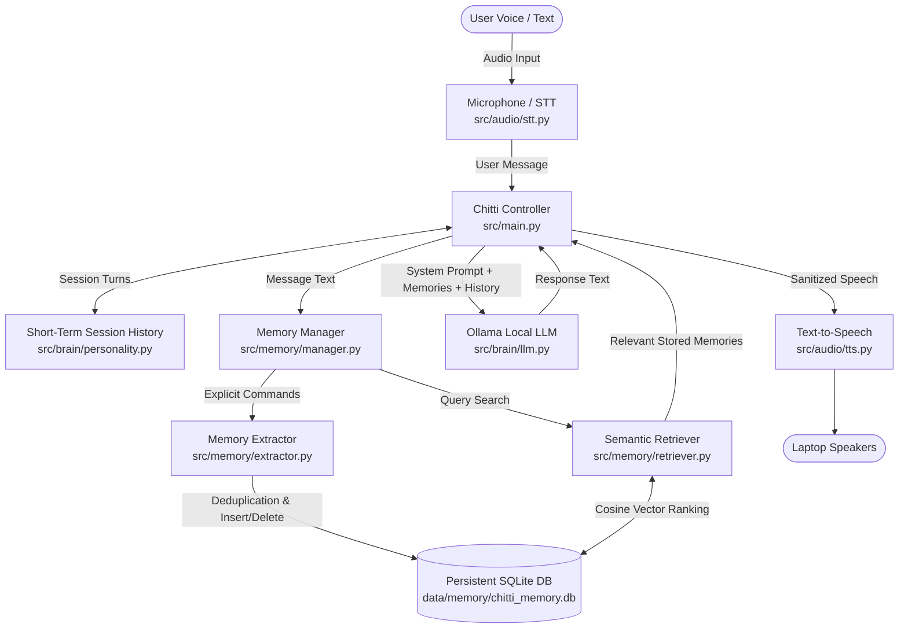

# 🤖 Chitti — Personal Multimodal AI Desktop Companion Robot

**Chitti** is an intelligent, interactive personal multimodal AI desktop companion robot running locally on Windows.

---

## 📌 Development Status

- ✅ **Phase 1: Voice AI Brain** *(Complete)*
- ✅ **Phase 2: Long-Term Persistent Memory** *(Complete)*
- ⏳ **Phase 3: Vision & Face Recognition** *(Upcoming)*
- ⏳ **Phase 4: Hardware & Actuators** *(Upcoming)*
- ⏳ **Phase 5: Autonomous Desktop Tools** *(Upcoming)*

---

## 🧠 Phase 1 & Phase 2 Architecture



---

## 🗄️ Phase 2: Persistent Long-Term Memory System

Chitti's long-term memory system does **not** dump entire conversation logs into a database. Instead, it extracts discrete facts, indexes them semantically, and retrieves only what is relevant:

### 1. SQLite Persistent Storage (`data/memory/chitti_memory.db`)
Each stored memory contains:
- **`id`**: Unique integer identifier
- **`content`**: Normalized memory text (e.g. *"User's main AI project is DocForensics AI"*)
- **`memory_type`**: Category (`fact`, `preference`, `project`, `instruction`, `personal`, `context`)
- **`importance`**: Importance level from 1 (low) to 5 (critical)
- **`created_at`** & **`updated_at`**: ISO8601 UTC timestamps
- **`embedding`**: Dense vector representation for semantic matching
- **`metadata`**: Extensible JSON dictionary

### 2. Semantic Retrieval & Scoring
When the user speaks or types a query:
1. An embedding vector is generated for the query using a local embedding engine (`SentenceTransformer` / `all-MiniLM-L6-v2` with a deterministic hashing fallback).
2. Cosine similarity is computed against all stored memory vectors.
3. Multi-factor score ranking:
   $$\text{Score} = (\text{Similarity} \times 0.70) + (\text{Normalized Importance} \times 0.20) + (\text{Recency Decay} \times 0.10)$$
4. Filtered above the configured similarity threshold and injected into the LLM system prompt.

### 3. Natural Language Memory Commands
Chitti natively understands conversational memory actions:
- **Remember**: *"Remember that my favorite programming language is Python."* → Extracts fact, checks for duplicates, and confirms: *"I'll remember that."*
- **Recall / Inspect**: *"What do you remember about my projects?"* or *"Show me what you remember"* → Summarizes stored facts.
- **Forget Specific**: *"Forget that my favorite programming language is Python."* → Locates the matching memory and deletes it.
- **Forget All (Safety Protected)**: *"Forget everything about me."* → Asks for explicit confirmation: *"You asked me to delete all stored memories. Should I proceed? Please say Yes or No."*
- **Deduplication**: If you say *"I like Python as my programming language"* and later *"Remember that I prefer Python"*, Chitti updates the existing record instead of creating duplicates.

### 4. Privacy & Secret Protection
Chitti enforces strict security filters:
- **No passwords, API keys, access tokens, or private keys** are stored in memory.
- If a user message contains sensitive patterns (e.g., `password is ...`, `sk-...`, `api_key=...`), Chitti immediately rejects persistent storage with a security notice.

---

## 💻 System & Hardware Requirements

- **Operating System**: Windows 10/11 (64-bit)
- **Python**: Python 3.10 - 3.14 (with PyTorch CUDA support)
- **GPU**: NVIDIA RTX 5050 Laptop GPU (8 GB VRAM) or any CUDA-compatible GPU (CPU fallback supported)
- **Microphone**: Built-in or USB microphone
- **Speakers**: Laptop speakers or headphones
- **Local LLM Server**: [Ollama](https://ollama.com/)

---

## 🚀 Installation & Setup

### 1. Install Dependencies
```powershell
python -m pip install -r requirements.txt
```

### 2. Start Ollama with Local Model
```powershell
ollama run qwen2.5-coder:7b
# or: ollama run llama3.2
```

### 3. Configure `.env`
Ensure `.env` exists (copied from `.env.example`):
```powershell
cp .env.example .env
```

---

## ⚙️ Configuration Reference

| Setting | Default | Description |
| :--- | :--- | :--- |
| `OLLAMA_BASE_URL` | `http://localhost:11434` | URL of the local Ollama daemon |
| `OLLAMA_MODEL` | `qwen2.5-coder:7b` | LLM model for conversational intelligence |
| `OLLAMA_TIMEOUT_SECONDS` | `60` | HTTP timeout for LLM inference |
| `STT_MODEL` | `base` | Whisper STT model size (`tiny`, `base`, `small`, `medium`) |
| `STT_DEVICE` | `auto` | `auto` (detects CUDA), `cuda`, or `cpu` |
| `TTS_ENGINE` | `pyttsx3` | Text-to-speech engine backend |
| `TTS_RATE` | `175` | Speech speed rate (words per minute) |
| `TTS_VOLUME` | `1.0` | Speech volume (0.0 to 1.0) |
| `MEMORY_ENABLED` | `true` | Enable persistent SQLite long-term memory |
| `MEMORY_DB_PATH` | `data/memory/chitti_memory.db` | SQLite database file location |
| `EMBEDDING_MODEL` | `all-MiniLM-L6-v2` | SentenceTransformer embedding model name |
| `MEMORY_TOP_K` | `5` | Maximum relevant memories retrieved per query |
| `MEMORY_SIMILARITY_THRESHOLD`| `0.35` | Minimum cosine similarity for memory injection |
| `MEMORY_IMPORTANCE_THRESHOLD`| `1` | Minimum memory importance level |
| `LOG_LEVEL` | `INFO` | Terminal log level (`DEBUG`, `INFO`, `WARNING`, `ERROR`) |

---

## 🎙️ How to Start & Use Chitti

Run Chitti:
```powershell
python src/main.py
```

### Interactive Controls
- **`[ENTER]`**: Speak to Chitti via Microphone (Push-to-talk with auto Voice Activity Detection).
- **`[T]` + `[ENTER]`**: Type a text message (keyboard fallback).
- **`[M]` + `[ENTER]`**: View all stored persistent long-term memories in the terminal.
- **`[C]` + `[ENTER]`**: Reset short-term session dialogue history.
- **`[Q]` + `[ENTER]`**: Cleanly quit Chitti.

---

## 🧪 Automated Testing

Run the full automated test suite:
```powershell
python -m pytest tests/ -v
```

### Test Coverage (46 Tests Passing):
- `tests/test_config.py`: Configuration validation, environment loading, device resolution.
- `tests/test_controller.py`: End-to-end controller loop, audio fallback, LLM error handling.
- `tests/test_history.py`: Short-term session memory, trimming, multi-turn dialogue.
- `tests/test_llm.py`: Ollama integration, connection errors, model not found, timeout resilience.
- `tests/test_microphone.py`: Sound device detection, stream capture, VAD error handling.
- `tests/test_stt.py`: Whisper speech-to-text, silence handling, numpy array normalization.
- `tests/test_tts.py`: pyttsx3 speech synthesis, markdown and link sanitization.
- `tests/test_memory_database.py`: SQLite schema, CRUD operations, categorical deletes, clearing.
- `tests/test_memory_extractor.py`: Natural language command parsing, safety secret filters.
- `tests/test_memory_retrieval.py`: Cosine similarity, multi-factor ranking, duplicate detection.
- `tests/test_memory_manager.py`: Full memory lifecycle, cross-session persistence, confirmation flows.

---

## ⚠️ Known Limitations (Phase 2 Scope)

1. **Local-Only Single Node**: Database resides on the local machine (`data/memory/chitti_memory.db`).
2. **Push-to-Talk Interaction**: Speech input starts on `ENTER` rather than continuous background wake-word listening.
3. **No Vision / Hardware Sensors**: Physical robot servos and computer vision are strictly reserved for Phase 3 and Phase 4.

---

## 🔮 Upcoming Phases

```text
Coming in Phase 3:
Vision and face recognition (Camera feed, OpenCV, face detection, visual person tracking)

Coming in Phase 4:
Robotics hardware & physical actuators (Microcontroller serial bridge, pan-tilt neck servos, display)

Coming in Phase 5:
Autonomous desktop tools (Local file tools, system automation, web research)
```
