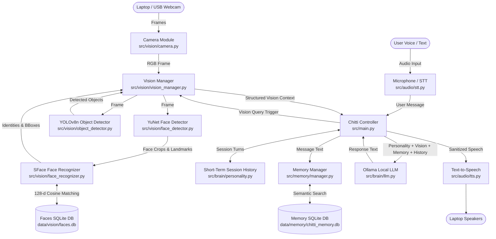

# 🤖 Chitti — Personal Multimodal AI Desktop Companion Robot

**Chitti** is an intelligent, interactive personal multimodal AI desktop companion robot running locally on Windows with local LLM intelligence, persistent long-term memory, and real-time computer vision.

---

## 📌 Development Status

- ✅ **Phase 1: Voice AI Brain** *(Complete)*
- ✅ **Phase 2: Long-Term Persistent Memory** *(Complete)*
- ✅ **Phase 3: Computer Vision & Face Recognition** *(Complete)*
- ⏳ **Phase 4: Physical Robot Hardware & Actuators** *(Upcoming)*
- ⏳ **Phase 5: Autonomous Desktop Tools** *(Upcoming)*

---

## 🧠 Multimodal Architecture (Phase 1, 2 & 3)



---

## 👁️ Phase 3: Computer Vision & Face Perception System

Phase 3 enables Chitti to see the environment, detect faces, recognize registered people, and identify common objects in real time without bogging down voice interaction.

### 1. Camera System (`src/vision/camera.py`)
- Automatically detects and enumerates connected cameras (DirectShow on Windows for zero-latency capture).
- Configurable resolution (default: $640 \times 480$) and FPS.
- Thread-safe frame reading with graceful error handling and clean release on exit.

### 2. Face Detection & Recognition
- **Detector (`src/vision/face_detector.py`)**: OpenCV YuNet ONNX deep learning face detector with dynamic frame resizing and fallback to Haar cascade.
- **Feature Extraction & Alignment (`src/vision/face_recognizer.py`)**: OpenCV SFace ONNX model extracting normalized 128-dimensional facial embeddings using 5-point facial landmark alignment.
- **Identity Matching**: Cosine similarity matching against registered vectors:
  $$\text{Cosine Similarity} = \frac{\mathbf{u} \cdot \mathbf{v}}{\|\mathbf{u}\| \|\mathbf{v}\|}$$
- **Unknown Handling**: Strict recognition threshold ($0.60$). If the cosine similarity is below the threshold, the person is classified as `"Unknown person"`. Chitti **never** guesses.
- **Multi-Person Support**: Seamlessly tracks multiple people in a single frame simultaneously.

### 3. Face Database & Privacy Design (`src/vision/face_database.py`)
- Stored separately from conversational memory in `data/vision/faces.db`.
- Multi-sample registration: captures multiple samples (default: 5) to generate a robust averaged vector.
- **Privacy First**: Only mathematical embeddings and metadata are stored; raw camera frames are deleted immediately after registration.
- Explicit face management commands (List registered people, delete identity, clear face database).

### 4. Object Detection (`src/vision/object_detector.py`)
- Ultralytics **YOLOv8n** lightweight object detector running locally on CUDA GPU or CPU.
- Filters and prioritizes common items (e.g. `person`, `laptop`, `cell phone`, `keyboard`, `mouse`, `bottle`, `cup`, `book`, `chair`, `backpack`).
- Structured results with bounding boxes, labels, and confidence metrics.

### 5. On-Demand & Vision Query Integration (`src/vision/vision_manager.py`)
- Automatically detects visual queries (e.g. *"What can you see?"*, *"Who is in front of you?"*, *"Is anyone there?"*).
- Captures an instant frame, executes vision inference, and formats a clean visual context block injected directly into Chitti's brain prompt.
- Does not spam LLM context on non-visual queries.

---

## 🗄️ Phase 2: Persistent Long-Term Memory System

- **SQLite DB**: `data/memory/chitti_memory.db` for explicit user facts and preferences.
- **Semantic Retrieval**: Ranked cosine retrieval using local embeddings (`all-MiniLM-L6-v2`).
- **Privacy Controls**: Automatic rejection of passwords, tokens, and sensitive secrets.

---

## ⚡ Performance Benchmarks (Empirically Measured)

Measured on **Windows 11, Intel Core i7 (24 threads), NVIDIA GeForce RTX 5050 Laptop GPU (8 GB VRAM)**:

| Module / Pipeline | Latency | Device / Framework |
| :--- | :--- | :--- |
| **YuNet Face Detection ($640 \times 480$)** | **7.48 ms** | OpenCV DNN / ONNX |
| **SFace Embedding & Alignment (128-d)** | **5.19 ms** | OpenCV SFace ONNX |
| **YOLOv8n Object Detection ($640 \times 480$)** | **7.12 ms** | PyTorch / CUDA (RTX 5050) |
| **Full Combined Vision Analysis** | **27.60 ms** | End-to-End Pipeline |
| **Vision Inference Throughput** | **~36.2 FPS** | Non-blocking Async Capable |
| **GPU VRAM Utilization (Vision)** | **45.7 MB** | Ultra-efficient footprint |

---

## 💻 System & Hardware Requirements

- **Operating System**: Windows 10/11 (64-bit)
- **Python**: Python 3.10 - 3.14 (with PyTorch CUDA support)
- **GPU**: NVIDIA RTX 5050 Laptop GPU (8 GB VRAM) or any CUDA-compatible GPU (CPU fallback fully supported)
- **Webcam**: Built-in laptop webcam or USB camera
- **Microphone & Speakers**: Built-in or external audio devices
- **Local LLM Server**: [Ollama](https://ollama.com/) (e.g., `qwen2.5-coder:7b` or `llama3.2`)

---

## 🚀 Installation & Setup

### 1. Install Dependencies
```powershell
python -m pip install -r requirements.txt
```

### 2. Verify / Download Vision Models
Pretrained models are stored in `models/vision/`:
- `models/vision/face_detection_yunet_2023mar.onnx` (YuNet Face Detector - ~335 KB)
- `models/vision/face_recognition_sface_2021dec.onnx` (SFace Face Recognizer - ~2.5 MB)
- `models/vision/yolov8n.pt` (Ultralytics YOLOv8 Nano - ~6.2 MB)

### 3. Start Ollama
```powershell
ollama run qwen2.5-coder:7b
```

### 4. Configure `.env`
```powershell
cp .env.example .env
```

---

## ⚙️ Configuration Reference

| Setting | Default | Description |
| :--- | :--- | :--- |
| `CAMERA_ENABLED` | `true` | Enable or disable camera capture |
| `CAMERA_INDEX` | `0` | Camera device index (0 for default webcam) |
| `CAMERA_WIDTH` | `640` | Camera capture width |
| `CAMERA_HEIGHT` | `480` | Camera capture height |
| `CAMERA_FPS` | `30` | Target camera capture frame rate |
| `VISION_ENABLED` | `true` | Enable or disable AI vision processing |
| `VISION_DEVICE` | `auto` | Execution device: `auto`, `cuda`, or `cpu` |
| `FACE_RECOGNITION_THRESHOLD` | `0.60` | Cosine similarity threshold for face recognition |
| `OBJECT_CONFIDENCE_THRESHOLD`| `0.35` | Minimum confidence score for object detections |
| `FACES_DB_PATH` | `data/vision/faces.db` | SQLite database for registered face embeddings |
| `MEMORY_ENABLED` | `true` | Enable persistent long-term memory |
| `MEMORY_DB_PATH` | `data/memory/chitti_memory.db` | SQLite database for user memory |
| `OLLAMA_MODEL` | `qwen2.5-coder:7b` | Local Ollama conversational model |

---

## 🎙️ How to Start & Use Chitti

Run Chitti:
```powershell
python src/main.py
```

### Interactive Controls
- **`[ENTER]`**: Speak to Chitti via Microphone (Push-to-talk with auto VAD).
- **`[T]` + `[ENTER]`**: Type a text message (keyboard fallback).
- **`[V]` + `[ENTER]`**: **Instant Visual Perception**: Captures camera frame and prints detected people and objects.
- **`[R]` + `[ENTER]`**: **Register Person's Face**: Starts the interactive multi-sample face registration wizard.
- **`[M]` + `[ENTER]`**: View all stored persistent long-term memories in the terminal.
- **`[C]` + `[ENTER]`**: Reset short-term session dialogue history.
- **`[Q]` + `[ENTER]`**: Cleanly release camera, audio streams, and quit.

### Example Vision Queries
- *"Chitti, what do you see?"*
- *"Who is in front of you?"*
- *"Is anyone there?"*
- *"What objects are on the desk?"*
- *"Who am I?"*

---

## 🧪 Automated Testing

Run the full automated test suite:
```powershell
python -m pytest tests/ -v
```

### Test Coverage (64 Tests Passing):
- `tests/test_camera.py`: Camera discovery, directshow init, frame capture, cleanup, failure handling.
- `tests/test_face_detector.py`: YuNet deep learning detection, empty frame handling, bounding boxes.
- `tests/test_face_recognizer.py`: SFace 128-d embedding extraction, cosine similarity, unknown thresholds.
- `tests/test_face_database.py`: Face CRUD operations, vector persistence, identity listing, deletion.
- `tests/test_object_detector.py`: YOLOv8 object detection, confidence filtering, empty scene handling.
- `tests/test_vision_manager.py`: Query intent detection, face + object fusion, LLM context formatting.
- `tests/test_config.py`: Configuration validation, environment loading, device resolution.
- `tests/test_controller.py`: Controller pipeline, audio fallback, LLM error handling.
- `tests/test_history.py`: Short-term session memory, trimming, multi-turn dialogue.
- `tests/test_llm.py`: Ollama integration, connection errors, model not found, timeout resilience.
- `tests/test_microphone.py`: Sound device detection, stream capture, VAD error handling.
- `tests/test_stt.py`: Whisper speech-to-text, silence handling, numpy array normalization.
- `tests/test_tts.py`: pyttsx3 speech synthesis, markdown and link sanitization.
- `tests/test_memory_database.py`: SQLite schema, CRUD operations, categorical deletes, clearing.
- `tests/test_memory_extractor.py`: Natural language command parsing, safety secret filters.
- `tests/test_memory_retrieval.py`: Cosine similarity, multi-factor ranking, duplicate detection.
- `tests/test_memory_manager.py`: Full memory lifecycle, cross-session persistence, confirmation flows.

---

## ⚠️ Known Limitations (Phase 3 Scope)

1. **2D Single-Camera Perception**: Uses monocular RGB camera without stereo depth or infrared depth sensing.
2. **Lighting Sensitivity**: Face recognition accuracy depends on adequate room illumination.
3. **No Physical Pan-Tilt Actuation**: Camera tracking is fixed to laptop/USB camera position (pan-tilt servos are scheduled for Phase 4).

---

## 🔮 Upcoming Phases

```text
Coming in Phase 4:
Physical robot hardware & actuators (ESP32/Arduino microcontroller bridge, pan-tilt neck servos, OLED display, physical chassis)

Coming in Phase 5:
Autonomous desktop tools (Local file system actions, shell automation, web research)
```
