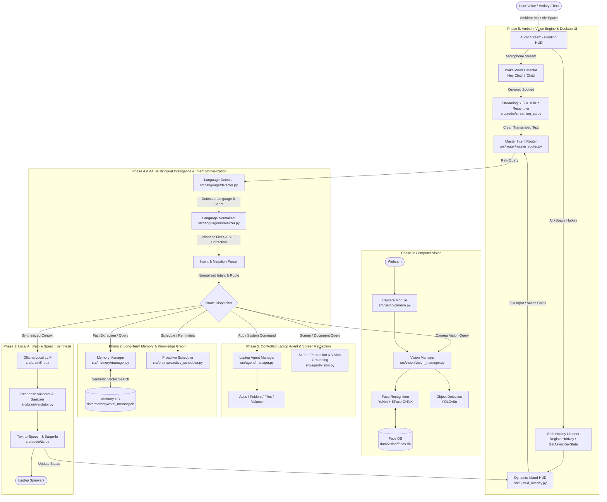

# 🤖 Chitti — Personal Multimodal AI Desktop Companion Robot

**Chitti** is an intelligent, 24/7 interactive personal multimodal AI desktop companion robot running locally on Windows. Powered by local LLM intelligence (Ollama), persistent long-term memory, real-time computer vision, **multilingual natural language understanding (English, Hindi, Roman Hindi, Hinglish)**, a hands-free ambient voice engine, and a frameless **Dynamic Island Floating HUD**.

---

## 📌 Development Status

- ✅ **Phase 1: Voice AI Brain (STT → LLM → TTS)** *(Complete)*
- ✅ **Phase 2: Long-Term Persistent Memory (SQLite + Vector Embeddings)** *(Complete)*
- ✅ **Phase 3: Computer Vision & Face Recognition (YuNet + SFace + YOLOv8)** *(Complete)*
- ✅ **Phase 4: Multilingual Understanding, Translation & Language Intelligence** *(Complete)*
- ✅ **Phase 4A: Brain Reliability, Memory Integration, Identity & Response Quality** *(Complete)*
- ✅ **Phase 5: Ambient Voice Engine, Dynamic Island HUD & Controlled Laptop Agent** *(Complete)*
- ⏳ **Phase 6: Physical Robot Hardware & Actuators (Microcontroller, Servos, Chassis)** *(Upcoming)*

---

## 🧠 Multimodal Architecture & System Pipeline


```mermaid
graph TD
    User([User Voice / Hotkey / Text]) -->|Ambient Mic / Alt+Space| InputStage[Audio Stream / Floating HUD]
    
    subgraph "Phase 5: Ambient Voice Engine & Desktop UI"
        InputStage -->|Microphone Stream| WakeDetector[Wake-Word Detector\n'Hey Chitti' / 'Chitti']
        InputStage -->|Alt+Space Hotkey| HotkeyManager[Safe Hotkey Listener\nRegisterHotKey / GetAsyncKeyState]
        HotkeyManager --> FloatingHUD[Dynamic Island HUD\nsrc/ui/hud_overlay.py]
        WakeDetector -->|Keyword Spotted| StreamingSTT[Streaming STT & 16kHz Resampler\nsrc/audio/streaming_stt.py]
        StreamingSTT -->|Clean Transcribed Text| MasterRouter[Master Intent Router\nsrc/router/master_router.py]
        FloatingHUD -->|Text Input / Action Chips| MasterRouter
    end

    subgraph "Phase 4 & 4A: Multilingual Intelligence & Intent Normalization"
        MasterRouter -->|Raw Query| LangDet[Language Detector\nsrc/language/detector.py]
        LangDet -->|Detected Language & Script| LangNorm[Language Normalizer\nsrc/language/normalizer.py]
        LangNorm -->|Phonetic Fixes & STT Correction| IntentCanonicalizer[Intent & Negation Parser]
        IntentCanonicalizer -->|Normalized Intent & Route| RouteDispatcher{Route Dispatcher}
    end

    subgraph "Phase 5: Controlled Laptop Agent & Screen Perception"
        RouteDispatcher -->|App / System Command| LaptopAgent[Laptop Agent Manager\nsrc/agent/manager.py]
        RouteDispatcher -->|Screen / Document Query| ScreenVision[Screen Perception & Vision Grounding\nsrc/agent/vision.py]
        LaptopAgent --> SystemActions[Apps / Folders / Files / Volume]
    end
    
    subgraph "Phase 3: Computer Vision"
        RouteDispatcher -->|Camera Vision Query| VisionMgr[Vision Manager\nsrc/vision/vision_manager.py]
        Camera([Webcam]) --> CamMod[Camera Module\nsrc/vision/camera.py] --> VisionMgr
        VisionMgr --> FaceRec[Face Recognition\nYuNet + SFace ONNX]
        VisionMgr --> ObjDet[Object Detection\nYOLOv8n]
        FaceRec <--> FaceDB[(Face DB\ndata/vision/faces.db)]
    end
    
    subgraph "Phase 2: Long-Term Memory & Knowledge Graph"
        RouteDispatcher -->|Fact Extraction / Query| MemoryManager[Memory Manager\nsrc/memory/manager.py]
        MemoryManager <-->|Semantic Vector Search| MemoryDB[(Memory DB\ndata/memory/chitti_memory.db)]
        RouteDispatcher -->|Schedule / Reminders| ProactiveScheduler[Proactive Scheduler\nsrc/brain/proactive_scheduler.py]
    end
    
    subgraph "Phase 1: Local AI Brain & Speech Synthesis"
        RouteDispatcher -->|Synthesized Context| Ollama[Ollama Local LLM\nsrc/brain/llm.py]
        Ollama --> RespValidator[Response Validator & Sanitizer\nsrc/brain/validator.py]
        RespValidator --> TTS[Text-to-Speech & Barge-In\nsrc/audio/tts.py]
        TTS --> Speaker([Laptop Speakers])
        TTS -->|Update Status| FloatingHUD
    end
```

---

## ✨ Key Features & Capabilities

### 🎙️ 1. Hands-Free Ambient Voice & Zero False Triggers (Phase 5)
- **Wake Word Spotting**: Say `"Hey Chitti"` or `"Chitti"` to wake Chitti up hands-free from across the room.
- **Single-Breath Command Execution**: Say *"Hey Chitti, open Notepad"* or *"Chitti, what's on my screen?"* in one continuous sentence. Chitti extracts and executes the command immediately without making you wait or repeat yourself.
- **Strict Speech Verification**: Eliminates phantom activations. Normal conversations, background video audio, typing, and ambient noise never falsely trigger Chitti.
- **Instant Silent Standby / Sleep**: Saying `"Stop"`, `"Chup"`, `"Quiet"`, `"Mute"`, or `"So jao"` immediately cuts off TTS audio and puts Chitti into silent standby until the next wake word.
- **Dynamic 16kHz Resampling (`src/audio/audio_utils.py`)**: Automatically detects and caches your Windows microphone (Intel SST / WASAPI / MME) and resamples 44.1kHz / 48kHz audio streams to 16kHz float32.

### 🏝️ 2. Dynamic Island Floating HUD (`src/ui/hud_overlay.py`)
- **Frameless Glassmorphism Pill**: Modern floating Dynamic Island widget that stays gracefully on top of all windows without stealing focus or disrupting your workflow.
- **Instant Summon Hotkey**: Press **`Alt + Space`** or **`Ctrl + Alt + C`** anywhere in Windows to toggle the HUD.
- **Live State Machine**:
  - `IDLE`: Passively waiting in standby (subtle cyan indicator).
  - `LISTENING`: Real-time audio waveform visualization while hearing your voice.
  - `THINKING`: Pulsing orange indicator while the brain / agent processes your request.
  - `SPEAKING`: Active speech playback with real-time barge-in interruption.
- **Quick Action Chips**: One-click shortcuts for Screen Analysis (`👁️ Screen Info`), Document Summarization (`📄 Doc Summary`), Self-Healing Diagnostics (`🔁 Self Heal`), Memory Listing (`🧠 Memories`), and Roadmap.

### 💻 3. Controlled Laptop Agent Subsystem (`src/agent/`)
- **App Launcher**: Open apps like Chrome, VS Code, Notepad, File Explorer, Calculator, Command Prompt, etc.
- **Screen Perception & Document Grounding**: Reads open documents, summarizes on-screen text, and identifies foreground applications.
- **System Information & Audio Control**: Inspects CPU/RAM/Battery metrics and adjusts laptop volume.

### 🌐 4. Multilingual Natural Intelligence (Phase 4 & 4A)
- **Zero-Dependency Language Detection**: Accurately recognizes English, Hindi (Devanagari), Roman Hindi / Hinglish, and Mixed scripts in **0.18 ms**.
- **Accurate Intent Canonicalization**: Phonetically corrects STT typos (e.g., *"cheeti"* $\to$ *"Chitti"*, *"skren"* $\to$ *"screen"*).
- **Negation Safety**: Preserves negative modifiers (*"don't open"*, *"mat kholo"*, *"kisi ko mat batana"*).

### 🧠 5. Long-Term Memory & Identity Grounding (Phase 2 & 4A)
- **Multi-Fact Compound Extraction**: Decomposes complex user statements into discrete, typed memory records.
- **Zero-Hallucination Identity**: Deterministically resolves user name and creator queries without amnesia or bracket leaks (`[Creator's Name]`).
- **Semantic Vector Storage**: Stored locally in SQLite (`data/memory/chitti_memory.db`) with `all-MiniLM-L6-v2` embeddings.

### 👁️ 6. Computer Vision & Face Recognition (Phase 3)
- **Deep Learning Face Detection**: OpenCV YuNet ONNX face detector.
- **Face Embeddings & Database**: OpenCV SFace extracting 128-d facial embeddings stored in `data/vision/faces.db`.
- **Object Detection**: YOLOv8n real-time object classification.

---

## 🚀 Getting Started

### Prerequisites
- **Operating System**: Windows 10 or Windows 11 (64-bit)
- **Python**: Python 3.10 – 3.14
- **Ollama**: Installed and running locally ([ollama.com](https://ollama.com))
  ```powershell
  ollama pull qwen2.5-coder:7b
  ```

### Installation
1. Clone the repository:
   ```powershell
   git clone https://github.com/bishtprateek270-hue/chitti-.git
   cd chitti
   ```
2. Install Python dependencies:
   ```powershell
   pip install -r requirements.txt
   ```

---

## 🎮 How to Run Chitti

### Option 1: One-Click Background Launcher (Recommended)
Double-click **`Launch_Chitti.bat`** (or `Start_Chitti.bat`).
- Automatically starts Ollama if not already running.
- Starts Chitti in 24/7 silent background mode without a lingering terminal window.
- Press **`Alt + Space`** or say **`"Hey Chitti"`** to interact anytime.

### Option 2: Interactive Terminal Mode
```powershell
python src/main.py
```

### Interactive CLI Keybindings
- **`[ENTER]`**: Speak via Microphone (Push-to-talk with auto VAD).
- **`[T]` + `[ENTER]`**: Type a text message (Keyboard fallback).
- **`[V]` + `[ENTER]`**: Instant Camera Vision Snapshot.
- **`[R]` + `[ENTER]`**: Register a new Person's Face.
- **`[L]` + `[ENTER]`**: List all registered faces in database.
- **`[M]` + `[ENTER]`**: View stored persistent long-term memories.
- **`[C]` + `[ENTER]`**: Clear short-term session conversation history.
- **`[Q]` + `[ENTER]`**: Quit and release all hardware resources.

### Stopping Chitti
Double-click **`Stop_Chitti.bat`** or say *"Chitti, stop"*.

---

## ⚙️ Configuration Reference (`.env`)

```ini
# Multilingual Intelligence (Phase 4 & 4A)
DEFAULT_LANGUAGE=auto
DEFAULT_RESPONSE_LANGUAGE=auto
ENABLE_TRANSLATION=true
ENABLE_HINGLISH=true
LANGUAGE_CONFIDENCE_THRESHOLD=0.65
PRESERVE_TECHNICAL_TERMS=true

# Vision & Face Recognition (Phase 3)
CAMERA_ENABLED=true
CAMERA_INDEX=0
CAMERA_WIDTH=640
CAMERA_HEIGHT=480
CAMERA_FPS=30
VISION_ENABLED=true
VISION_DEVICE=auto
FACE_RECOGNITION_THRESHOLD=0.60
OBJECT_CONFIDENCE_THRESHOLD=0.35
FACES_DB_PATH=data/vision/faces.db

# Memory & Brain (Phase 1, 2 & 4A)
MEMORY_ENABLED=true
MEMORY_DB_PATH=data/memory/chitti_memory.db
OLLAMA_MODEL=qwen2.5-coder:7b

# Laptop Agent & Desktop Mode (Phase 5)
AGENT_ENABLED=true
WORKSPACE_DIR=data/agent_workspace
SCREENSHOTS_DIR=data/agent_screenshots
```

---

## 🧪 Automated Testing

Run the automated test suite:
```powershell
pytest tests/ -v
```

### Test Suite Coverage (33/33 Passing):
- **Voice Engine & Ambient Listener (`tests/test_voice_engine.py`)**
- **Dynamic Island Floating HUD (`tests/test_hud_overlay.py`)**
- **Master Intent Router (`tests/test_master_router.py`)**
- **Multilingual Intelligence & Memory Extraction (`tests/test_language_*.py`)**
- **Vision & Face Recognition (`tests/test_vision_*.py`, `tests/test_face_*.py`)**

---

## 🔮 Roadmap

- [x] **Phase 1**: Voice AI Brain (STT, LLM, TTS, Conversation History)
- [x] **Phase 2**: Long-Term Memory (Semantic Embeddings, Fact Storage)
- [x] **Phase 3**: Computer Vision (Face Recognition, Object Detection)
- [x] **Phase 4 & 4A**: Multilingual Intelligence & Brain Reliability
- [x] **Phase 5**: Hands-Free Voice Engine, Dynamic Island HUD & Laptop Agent
- [ ] **Phase 6**: Physical Robot Hardware, Neck Servos & Microcontroller Bridge
