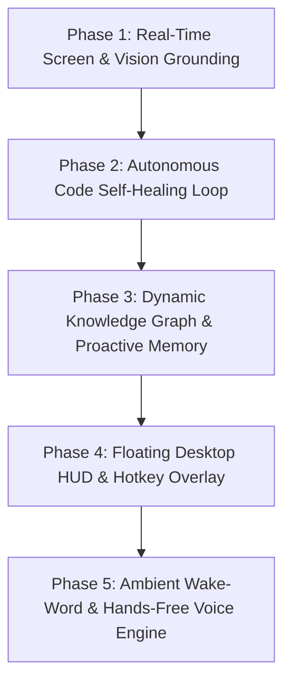

# Chitti Next-Gen Architecture & Implementation Roadmap

To transform **Chitti** into a state-of-the-art autonomous OS companion, we will build out the remaining advanced capabilities across 5 structured phases. Each phase is independently testable and integrates directly into Chitti's existing modular architecture.

---

## 🗺️ Phase-Wise Roadmap Overview

---

### 👁️ Phase 1: Real-Time Screen & Vision Grounding Engine ("Look & Act")
**Goal**: Allow Chitti to "see" your active screen, read error messages, inspect open PDFs/webpages, and take targeted actions based on visual context.

- **Key Modules**:
  - `src/agent/vision/screen_reader.py`: Multi-monitor and active-window screenshot capture with bounding box extraction.
  - `src/agent/vision/ocr_analyzer.py`: High-speed local OCR & Multimodal LLM vision pipeline for analyzing UI state.
  - `src/agent/intent.py` & `src/agent/planner.py`: Add `ANALYZE_SCREEN`, `FIX_SCREEN_ERROR`, and `INSPECT_ACTIVE_WINDOW` intents.
- **Example Commands**:
  - *"Chitti, look at my screen and tell me why my code is failing."*
  - *"Chitti, summarize what is currently open on my screen."*
  - *"Chitti, read this error popup and click OK."*
- **Deliverables & Testing**: Full vision engine with mocked & live multimodal tests in `tests/test_vision_grounding.py`.

---

### 🔁 Phase 2: Autonomous Multi-File Code Self-Healing Loop
**Goal**: When creating or modifying code, Chitti runs the project, captures runtime/compiler errors, edits the code to fix bugs, and verifies the solution until it runs successfully.

- **Key Modules**:
  - `src/agent/debugger/runner.py`: Multi-language test & execution sandbox (Python, Node.js, C++, Java).
  - `src/agent/debugger/self_healer.py`: Automated traceback parsing, error diagnosis, targeted patching, and max-retry verification loop.
  - `src/agent/code_generator.py`: Extended multi-file project generation and automated unit test authoring.
- **Example Commands**:
  - *"Chitti, build a weather scraper in Python and make sure it runs without errors."*
  - *"Chitti, run the tests in this folder and fix whatever is broken."*
- **Deliverables & Testing**: End-to-end self-healing tests in `tests/test_self_healing_debugger.py`.

---

### 🧠 Phase 3: Dynamic Knowledge Graph & Proactive Memory
**Goal**: Long-term memory of contacts, project workflows, preferences, and daily routines with proactive notifications.

- **Key Modules**:
  - `src/brain/knowledge_graph.py`: Entity-relationship graph (People, Projects, Workspaces, Preferences).
  - `src/brain/proactive_scheduler.py`: Background job scheduler for reminders, morning briefings, and Git branch checks.
  - `src/brain/memory.py`: Semantic search and automatic extraction of user preferences from dialogue.
- **Example Commands**:
  - *"Chitti, remember that Rohit is my project lead and his email is rohit@company.com."*
  - *"Chitti, remind me at 6 PM to commit my git changes."*
  - *"Chitti, what are my pending tasks for today?"*
- **Deliverables & Testing**: Graph storage & proactive trigger tests in `tests/test_knowledge_graph.py`.

---

### ⚡ Phase 4: Floating Desktop HUD & Global Hotkey Overlay ("Dynamic Island")
**Goal**: A minimalist, futuristic desktop widget that stays on top of all windows and can be summoned anytime with `Alt + Space`.

- **Key Modules**:
  - `src/ui/hud_overlay.py`: Lightweight frameless translucent floating widget with dark glassmorphism.
  - `src/ui/hotkey_listener.py`: Global background hotkey capture (`Alt+Space` or `Win+Space`).
  - `src/ui/visualizer.py`: Pulsing audio waveform, live execution step list, and quick-action buttons.
- **Features**:
  - Instant text & voice input box without opening terminal or browser.
  - Real-time step progress (e.g., `[Step 1/3: Opening VS Code]`, `[Step 2/3: Compiling]`).
- **Deliverables & Testing**: GUI smoke tests and lifecycle verification in `tests/test_hud_overlay.py`.

---

### 🎙️ Phase 5: Ambient Wake-Word & Low-Latency Voice Engine
**Goal**: 100% hands-free conversation with instantaneous wake-word detection (`"Hey Chitti"` / `"Chitti"`), interruption handling, and smooth TTS.

- **Key Modules**:
  - `src/voice/wake_word.py`: Efficient local keyword spotter (openWakeWord / Porcupine).
  - `src/voice/streaming_stt.py`: Real-time streaming speech-to-text with auto-silence cutoff.
  - `src/voice/audio_interrupter.py`: Barge-in detection to pause speech when the user starts talking.
- **Example Usage**:
  - Saying *"Hey Chitti, mute the laptop"* from across the room executes instantly.
- **Deliverables & Testing**: Acoustic mock tests and voice loop integration in `tests/test_voice_engine.py`.

---

## 🚀 Execution Strategy

We will execute this plan sequentially, starting with **Phase 1: Real-Time Screen & Vision Grounding Engine**.

At each phase, we will:
1. Build the core modules with clean interfaces and zero external breaking changes.
2. Connect them into `LaptopAgentManager`, `ActionIntentAnalyzer`, and `AgentPlanner`.
3. Add comprehensive automated unit and integration tests.
4. Verify all existing tests pass (100% regression protection).
5. Commit and push updates to `origin/main`.
